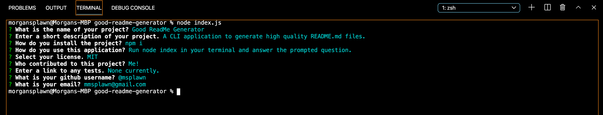

# **Good Readme Generator**                 

  # Project Description
  A simple commandline application for generating quality, well formatted readme files.
  
  # Demo Video
  [Demo Video](https://drive.google.com/file/d/12rEhNB14mDuf5S-Ie1kB2dj9p0ey69zL/view)

  # Screencap
  

  # Table of Contents
  * [Installation](#installation)
  * [Usage](#usage)
  * [License](#license)
  * [Contributors](#contributors)
  * [Questions](#questions)
  
  # Installation
  Download the zip and navigate to your terminal to run npm install.

  # Usage
  In your terminal navigate to your project's folder then type 'node index.js'

  # License
  Apache

  # Contributors
  Me!

  # Questions
  If you have any further questions feel free to contact me on Github @msplawn or email me at mmsplawn@gmail.com!

